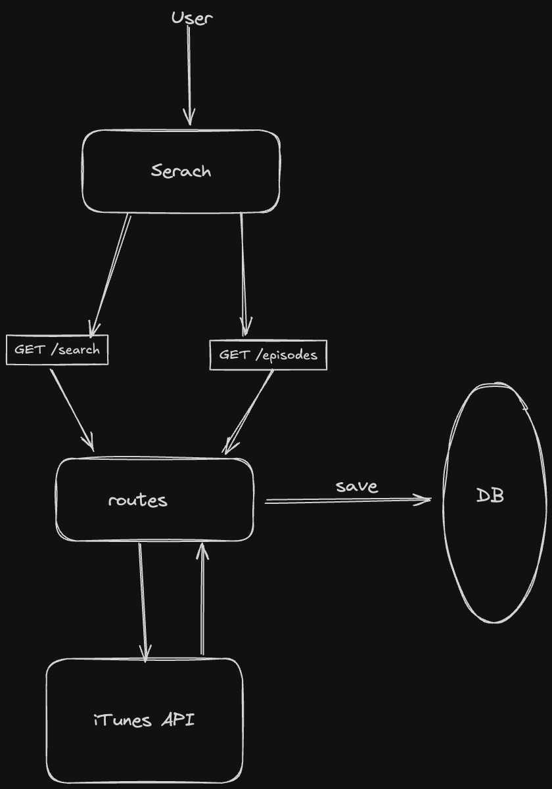

# iTunes Podcast Search App

- **Backend**: Fastify + TypeScript + Prisma
- **Frontend**: Next.js + TailwindCSS + shadcn/ui
- **Database**: Supabase (PostgreSQL)

---

## Features

- Search podcasts by keyword
- View podcast details and artwork
- Display episodes for each podcast
- Backend integrates iTunes API and Supabase
  

---

## Local Development

### 1. Clone the project

```bash
git clone https://github.com/Wabel-v0/simple-podcast-search.git
cd simple-podcast-search
```

### 2.Setup Backend

```bash

cd backend
set your env # Add your Supabase credentials
npm install
npx prisma generate
npx ts-node src/index.ts
Runs at: http://localhost:4000
```

### 3. Setup Frontend

```bash
cd frontend
set your env
npm install
npm run dev
Runs at: http://localhost:3000
```

## API Endpoints

- `GET /search?term=queen` → Search podcasts
- `GET /episodes?ids=123,456` → Get episodes for multiple podcast IDs
